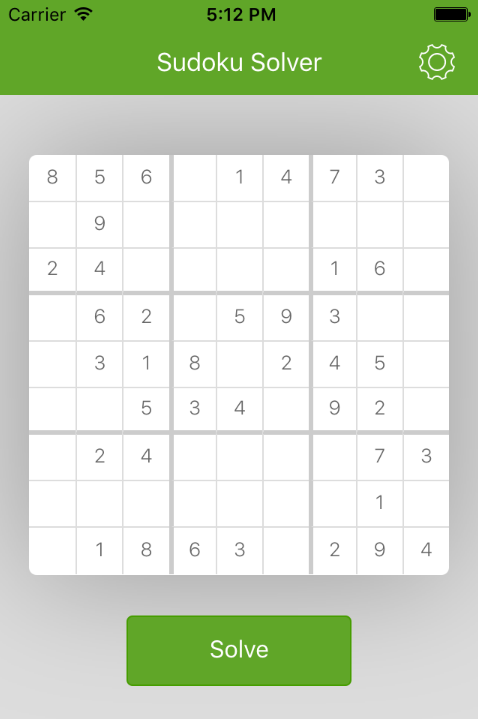
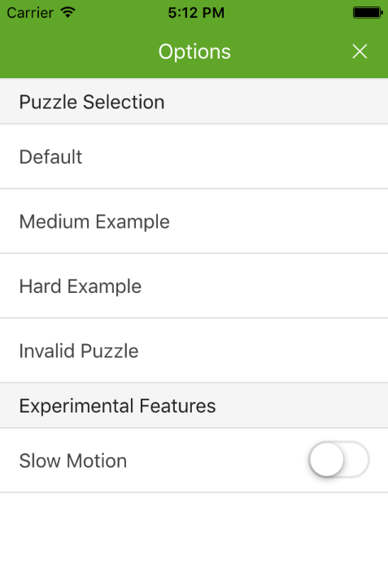

# Sudoku Solver

A hybrid-mobile app that solves sudoku puzzles. The algorithm uses a recursive approach, which determines all candidates for an empty grid cell, places a candidate in that cell, and repeats for following cells until a cell is unsolvable (there are no valid candidates left for the empty grid cell). At this stage, the recursive function returns up the call stack (backtracking) and attempts another candidate for the previous cells.

## Install dependencies

Globally install dev tools:

`npm install -g cordova ionic gulp karma`

In the project folder, run:

`npm install && bower install`

## Run the app

To view the app in a web browser:

`ionic serve`

A browser should start and display the app. If not, navigate to `http://localhost:8100`.

To run on an iOS emulator:

`ionic platform add ios`
`ionic emulate ios`

Wait for the emulator to open.

> To deploy through Xcode, open `./platforms/ios/Sudoku Solver.xcodeproj` and hit the play button.

## Run the unit tests

`gulp unit-tests`

## View the API docs

Documentation is automatically generated from JSDoc comments throughout the code. To view the docs, open `./docs/gen/index.html`. Note the 'Classes' drodpown in the menu bar.

## Using the app

By default, a puzzle is loaded into the main view. Tap the 'Solve' button to solve the puzzle. To switch between puzzles, hit the settings icon in the top right, and tap a puzzle.

> The "Experimental" section is exactly that... experimental :). Enabling "Slow Motion" will use a Web Worker instead of the angular service to solve the puzzle. There are spin-loops in the Web Worker to allow for incremental UI updates to visualize the solution as it is formed. Not recommended for use on an actual mobile phone (desktop browser only)

## Loading your own puzzle

To load your own puzzle to solve, open up `./www/app/common/puzzles.value.js`. You can add a data structure in the following format to the array of puzzles:

```
{
    name: 'My Test Puzzle',
    date: [] // array of 81 elements (0 represents an empty cell)
}
```

## Screenshots

### Main UI



### Options Pane


